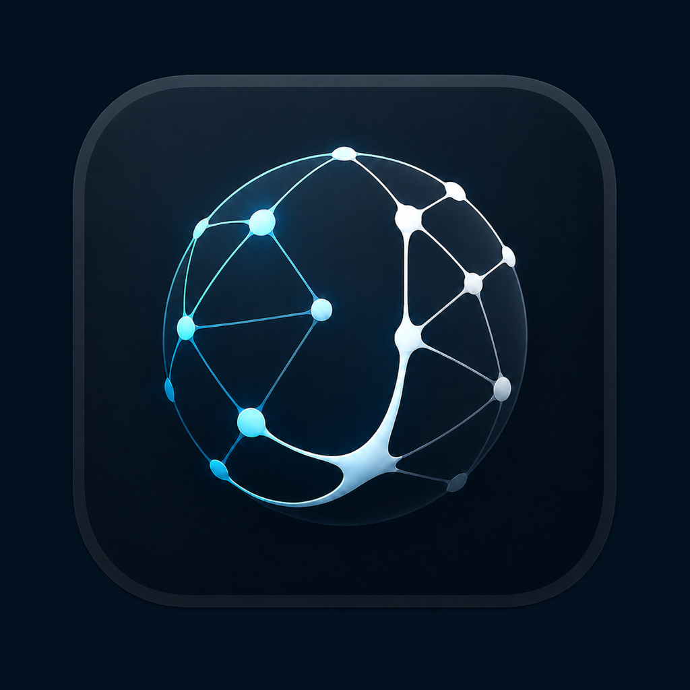

# Jarvis

Núcleo local, auditable y *voice-first* para un asistente táctico multiagente en macOS Apple Silicon.

> Instalación desde cero, credenciales, permisos, voz y diagnóstico:
> [Manual de instalación y configuración](docs/MANUAL_INSTALACION_CONFIGURACION.md).

Jarvis es el nombre visible de la aplicación. El namespace técnico heredado `aegis` se conserva en
el paquete Python, variables de entorno, servicios de Keychain, identificadores de bundle y rutas de
datos para mantener credenciales, permisos TCC, memoria y LaunchAgents existentes.



La identidad visual usa una esfera de nodos con una `J` implícita, alineada con los clústeres del
HUD. El master PNG de 1024 px y el recurso macOS `Jarvis.icns` viven junto al `Info.plist`. La Menu
Bar usa en cambio el símbolo template nativo `circle.hexagongrid.fill`, sin fondo y adaptativo al
tema. Los estados permanecen dentro del menú para no comprometer la legibilidad del icono. El icono
de aplicación puede regenerarse sin dependencias externas con:

```bash
swift script/build_macos_icon.swift \
  native/AegisAudio/AppBundle/Resources/JarvisLogo.png \
  native/AegisAudio/AppBundle/Resources/Jarvis.icns
```

Esta primera vertical contiene:

- contratos tipados para solicitudes, rutas y respuestas;
- registro central de modelos NVIDIA NIM;
- cerebro híbrido on-device/NVIDIA para separar conversación breve de trabajo especializado;
- cliente HTTP asíncrono compatible con los endpoints NIM;
- recuperación de la credencial desde macOS Keychain;
- grafo LangGraph mínimo con escalamiento por especialidad;
- Tool Broker con capacidades por agente y política de denegación por defecto;
- investigación web pública y control acotado de Mail, Calendario y aplicaciones bajo política;
- control visual autónomo de una sola aplicación mediante un helper macOS nativo y firmado;
- ejecutores locales auditados, incluido sondeo TCP acotado, con auditoría JSONL encadenada;
- daemon local autenticado mediante Unix Domain Socket;
- memoria persistente local con SQLite/FTS5 y aislamiento por namespace;
- memoria evolutiva con evidencia, confianza, confirmación y caducidad;
- telemetría de amplitud local con Swift/Accelerate y sin retención de PCM;
- cliente Swift del UDS con autenticación mutua y credencial IPC en Keychain;
- pruebas sin llamadas reales a servicios externos.

## Roadmap activo

| Fase | Estado | Corte actual |
| --- | --- | --- |
| 1. Orquestación | operativa | LangGraph, jobs y LaunchAgent |
| 2. Memoria | operativa | SQLite/FTS5, RAG híbrido y conversaciones |
| 3. Sensores | operativa | voz on-device, imagen y pantalla explícitas |
| 4. Ciberseguridad | operativa | broker, aprobación, red, diagnósticos y monitor de integridad |
| 5. Interfaz | operativa | Menu Bar, atajo global, HUD 3D explícito y pulso de voz |

Las cinco fases del MVP están operativas. Distribución notarizada, actualizaciones automáticas y
automatización arbitraria permanecen fuera de alcance. Enviar correo, crear eventos, abrir apps o
URLs y el control visual acotado son las mutaciones externas habilitadas; todas exigen confirmación
exacta de un solo uso.
La activación local por la palabra “Jarvis” está implementada como opt-in, pero permanece
fail-closed hasta entrenar y empaquetar un modelo real con muestras explícitas del usuario.

## Distribución macOS

El empaquetado local usa Release y firma ad hoc. Para generar un archivo de distribución se requiere
una identidad `Developer ID Application` instalada; para notarizar se requiere además un perfil de
`notarytool` guardado previamente en Keychain:

```bash
AEGIS_CODESIGN_IDENTITY="Developer ID Application: …" ./script/release_macos.sh archive
AEGIS_CODESIGN_IDENTITY="Developer ID Application: …" \
AEGIS_NOTARY_PROFILE="aegis-notary" ./script/release_macos.sh notarize
```

La firma de distribución activa hardened runtime y timestamp de Apple. El bundle declara solamente
entrada de audio y Apple Events, requeridos por sus capacidades de voz y automatización. El flujo
valida arquitectura arm64, estructura, firma, ZIP, ticket grapado y Gatekeeper; no acepta secretos
por argumentos ni los guarda en el repositorio.

## Endurecimiento post-MVP

La suite somete el IPC autenticado a una ráfaga sintética de 24 trabajos con capacidad local 8. El
daemon debe aceptar exactamente ocho, rechazar el exceso con `job_capacity_reached` y completar los
aceptados después de liberar el proveedor falso. No usa NVIDIA, credenciales ni datos persistentes.

El cliente NVIDIA también se prueba con seis solicitudes sintéticas y concurrencia configurada en
dos. El transporte simulado nunca debe observar más de dos solicitudes activas.
El modelo primario y su fallback comparten un único presupuesto de timeout; agotarlo cancela el
turno y libera capacidad para el siguiente trabajo.
Las respuestas `410` (endpoint retirado) y `202` (ejecución asíncrona no compatible con este cliente
síncrono) conmutan una sola vez al fallback registrado. Los roles con herramientas usan endpoints
gratuitos comprobados en vivo: `openai/gpt-oss-20b` para planificación rápida,
`deepseek-ai/deepseek-v4-flash-0731` para código/ciberseguridad y razonamiento largo, y
`minimaxai/minimax-m3` como respaldo del razonador crítico.
El routing común se resuelve localmente por modalidad y términos exactos; no consume una inferencia
ni un presupuesto de razonamiento para clasificar una solicitud breve.
Un `429` definitivo abre un cooldown local compartido por chat y embeddings. Durante cinco segundos
las nuevas llamadas fallan localmente, sin consultar Keychain ni enviar tráfico adicional.

## Cerebro híbrido y conversación en streaming

Las conversaciones breves, textuales y sin intención de herramienta intentan primero el modelo de
sistema de Apple mediante el helper privado `jarvis-local-brain`. Esta ruta se ejecuta on-device y
no consulta Keychain ni abre red. Requiere macOS 26 y Apple Intelligence disponible; si el sistema
no lo ofrece, el helper falla cerrado y LangGraph conmuta a NVIDIA NIM. Código, ciberseguridad,
visión, contexto largo y la planificación no determinista de acciones permanecen en los
especialistas NVIDIA asignados.
La memoria de esta ruta usa exclusivamente SQLite/FTS5 y el perfil local, incluso cuando el RAG
semántico remoto está habilitado. Memoria y perfil se recuperan en paralelo. Si el helper local
falla antes de emitir texto, un cortacircuito evita reintentarlo durante 30 segundos y los turnos
siguientes pasan directamente a NVIDIA.
El detector de intención no activa herramientas por una palabra aislada. Expresiones casuales como
«¿cómo estás hoy?» o «me gusta esta app» permanecen locales; se requiere un verbo operativo junto
con una capacidad admitida, una orden de investigación o una consulta explícita de información
actual. Esta clasificación solo elige el camino de inferencia: el broker y la confirmación de un
solo uso continúan siendo la única autorización para ejecutar acciones.
Órdenes exactas para abrir Safari, Chrome, Firefox, Calendario, Mail, Notas, Vista Previa, Xcode o
Spotify; ejecutar un atajo con nombre literal; y lanzar uno de los cuatro diagnósticos fijos se
convierten localmente en una propuesta de herramienta. No recuperan memoria ni llaman a un modelo,
pero se detienen en la misma confirmación, política y auditoría. Una orden compuesta, negada,
multimodal, desconocida o forzada a remoto sigue el camino NVIDIA normal.
Cuando NVIDIA sí es necesario, recibe únicamente los esquemas del dominio explícito: Mail,
Calendario, web, archivo, red, diagnóstico, aplicación, atajo o control visual. El caso común baja
de 13 esquemas a uno en el planner y de 6 a uno en seguridad, reduciendo entre 83 % y 92 % los bytes
de definición medidos. El broker enlaza la autorización a ese mismo conjunto y deniega como
`tool_not_offered` cualquier función distinta que el proveedor intente devolver. Una frase
operativa que no pueda clasificarse conserva todos los esquemas compatibles con el rol.
Las lecturas exactas «Revisa mi correo», «Muéstrame mis correos no leídos», «Qué tengo hoy» y
«Revisa mi calendario» se planifican localmente con límites fijos de 10 mensajes y 20 eventos del
día local. Mail continúa entregando solo remitente, asunto, fecha y estado de lectura, nunca cuerpos.
El resultado se sintetiza con Apple Intelligence on-device; si el helper local no está disponible
antes del primer delta, se usa el fallback NVIDIA existente. Así se elimina una ronda remota de
planificación y, en el caso normal, los metadatos tampoco abandonan el Mac.

Las órdenes exactas «Busca …»/«Investiga …» y «Lee https://…» también omiten la planificación
remota. La primera investiga hasta tres resultados públicos y la segunda extrae como máximo 8.000
caracteres; ambas conservan el cliente HTTPS endurecido, la política y la auditoría, y sintetizan
con Apple Intelligence on-device con fallback NVIDIA. «Abre https://…» prepara directamente la
acción de navegador, pero continúa detenida hasta una confirmación de un solo uso. El camino directo
no admite HTTP, cookies, sesiones autenticadas, instrucciones compuestas ni navegación visual.

«Lee el archivo README.md» lee como máximo 8 KiB de un archivo UTF-8 regular dentro del workspace y
lo sintetiza on-device con el mismo fallback. La ruta debe ser relativa; el broker y el descriptor
seguro rechazan escapes, rutas absolutas y enlaces que salgan del workspace, y no siguen enlaces
durante la apertura. «Revisa el archivo…» no usa este atajo: conserva el especialista NVIDIA de
código/ciberseguridad para análisis que requiera razonamiento.

Cuando una solicitud menos exacta requiere que el planner NVIDIA seleccione una lectura de Mail,
Calendario o web, el resultado ya no provoca una segunda ronda NVIDIA: Apple Intelligence lo resume
on-device. El helper local nunca recibe esquemas ni ejecuta herramientas; broker, ejecutor y
auditoría terminan primero. Si Apple no puede iniciar, el synthesizer NVIDIA sigue siendo el fallback.
Las lecturas del rol de código/ciberseguridad permanecen remotas para no degradar el análisis.

Si una lectura válida confirma que no existen mensajes, eventos, resultados, texto web o bytes de
archivo, Jarvis tampoco invoca el modelo local: publica de inmediato una frase fija y verificable.
La optimización exige éxito, herramienta compatible, rol permitido y estructura exacta; una salida
malformada, no vacía o de ciberseguridad conserva el synthesizer habitual.

Los fallos de lectura ya clasificados también evitan una síntesis redundante. Archivo inexistente,
UTF-8 inválido, acceso denegado por macOS, timeout, fallo HTTPS o error de I/O producen mensajes fijos
sin incluir ruta, URL, consulta ni argumentos. Solo se aplica después de una autorización y ejecución
auditadas; códigos desconocidos conservan el camino normal.

«Describe este Mac» o «¿Qué Mac tengo?» consulta metadatos nativos verificados y responde sin ningún
modelo. En macOS añade chip, identificador de hardware y memoria mediante una invocación fija de
`sysctl` con timeout de un segundo; arquitectura, versión de macOS y runtime permanecen disponibles
si esa consulta opcional falla. No ejecuta shell, no recupera memoria y no abre red.

«Estado de la batería», «¿Cuánta batería queda?» o «¿Cómo está la batería?» consulta `pmset` bajo
demanda y responde sin ningún modelo. La orden es fija, vence al segundo y descarta el identificador
interno de la batería: solo conserva porcentaje, carga o descarga, fuente de energía y autonomía
estimada. No existe monitor ni *polling* energético en segundo plano.

«¿Cuánto almacenamiento queda?», «¿Cuánto espacio libre queda?» o «Estado del almacenamiento» usa
`statvfs` sobre el volumen de inicio y responde sin ningún modelo. La lectura expone únicamente bytes
totales, disponibles y usados; no enumera volúmenes, rutas, archivos, snapshots ni identificadores.
No abre procesos, solicita permisos o instala un monitor.

«¿Qué hora es?», «¿Qué fecha es hoy?» y «Dime la fecha y hora» responden directamente desde el reloj
local y su zona horaria, también sin modelos. La ruta no recupera memoria, registra herramientas ni
abre procesos; preguntas sobre otras zonas horarias conservan el cerebro conversacional.

Operaciones explícitas como «Calcula 12,5 por 4» o «¿Cuánto es 144 dividido entre 12?» usan una
gramática decimal local, sin `eval` ni modelos. Solo se aceptan dos operandos y suma, resta,
multiplicación o división; expresiones compuestas y valores fuera de límites siguen el flujo normal.

Órdenes de voz exactas como «Pon un temporizador de 5 minutos» se resuelven dentro de la app nativa,
antes de usar IPC o modelos. Jarvis mantiene un único temporizador de entre un segundo y 24 horas;
«Estado del temporizador» informa el tiempo restante, «Pausa/Reanuda el temporizador» controla su
avance y «Cancela el temporizador» lo elimina. Al terminar emite un aviso sonoro y lo anuncia por voz
si no interrumpe otro turno. Es efímero: cerrar o reiniciar la app lo cancela y no deja historial.

«¿Qué aplicación estoy usando?» obtiene localmente la aplicación en primer plano mediante
`NSWorkspace` y responde sin capturar pantalla ni enviar el transcript a modelos o `voice.submit`.
Solo pronuncia un nombre normalizado y acotado; no expone ni registra bundle identifier, ventanas,
documentos o contenido de la aplicación.

Apple y NVIDIA publican deltas monotónicos durante la generación. El job expone una instantánea
parcial versionada por IPC y la app empieza a sintetizar únicamente frases completas, sin repetir
texto. Decir «Jarvis» mientras procesa o habla cancela el job y la voz actuales y abre un turno
nuevo. La frase de activación continúa siendo local; no existe transcripción remota permanente.
Si NVIDIA TTS no inicia dentro de 1,8 segundos, Jarvis usa voz local para todo el resto de esa
respuesta; no alterna timbres ni repite la espera en cada frase.

Cada job terminal produce automáticamente una evaluación acotada: cerebro elegido, modelo,
latencia total, latencia al primer fragmento, cantidad de fragmentos, herramienta, finalización y
postcondición verificada. No se guardan prompt ni respuesta en esa telemetría. El agregado de la
sesión puede consultarse con:

```bash
./script/aegis.sh self-evaluation
```

El marcador exige al menos 20 trabajos antes de emitir `competitive`. Sus objetivos iniciales son
95 % de éxito, primer fragmento p95 de hasta 2 segundos y conversación completa p95 de hasta
8 segundos. Las acciones se cuentan por separado para que una interfaz rápida no oculte fallos de
herramientas. El control visual solo suma como acción correcta cuando una captura posterior prueba
el objetivo; detenerse por incertidumbre, seguridad o límite de pasos no se registra como éxito.
Cuando existen turnos de voz, también exige que al menos 90 % coincidan con el único perfil local
del propietario. Solo publica el agregado y dos booleanos por job; nunca el identificador, la
confianza, el transcript ni una huella de voz.

## Seguridad

La API key no debe guardarse en el repositorio ni en archivos `.env`. El servicio de Keychain usado por defecto es `ai.aegis.nvidia-nim`, con la cuenta `default`.

El daemon expone por IPC autenticado únicamente si esa entrada de Keychain existe. La consulta usa
`security find-generic-password` sin `-w`: no lee, imprime, copia ni crea la credencial. Los estados
son `configured`, `missing` y `unavailable`; `configured` confirma presencia local, no vigencia ni
conectividad con NVIDIA. Estas últimas se comprueban solo mediante los probes explícitos.

El cliente NVIDIA controla `model`, `messages`, `stream` y `max_tokens`. Las extensiones solo pueden
usar las cuatro opciones requeridas por function calling y probes; cualquier otra se
rechaza antes de consultar Keychain o abrir red.

El descubrimiento de red solo usa conexiones TCP nativas contra IP/CIDR de loopback o redes privadas
autorizadas. Cada llamada exige confirmación exacta de un solo uso, entre uno y ocho puertos, y un
máximo de 256 direcciones. No ejecuta shell, `ping` ni `nmap`; tampoco hace DNS, fingerprinting,
envía payloads o persiste resultados. El ejecutor vuelve a validar alcance y límites aunque reciba
una autorización falsificada.

## Entorno

El proyecto requiere Python 3.11, 3.12 o 3.13 nativo `arm64`. La configuración evita depender de contenedores o binarios x86 para el núcleo local.
Los scripts Swift inspeccionan el SDK macOS activo de `/usr/bin/xcrun` y, si requiere un macro
SwiftUI ausente en el toolchain, eligen el SDK compatible más reciente del mismo directorio.
`AEGIS_MACOS_SDK` permite fijar una ruta explícita; una ruta inexistente falla antes de compilar o
crear el modelo. Build, pruebas y entrenador ejecutan el binario `swift` resuelto por el mismo
`xcrun`, nunca una coincidencia distinta tomada de `PATH`.

```bash
uv sync --all-groups --no-editable --python /opt/homebrew/bin/python3.11 --cache-dir .uv-cache
uv run --no-sync pytest
./script/aegis.sh doctor
```

`aegis doctor` verifica arquitectura, configuración y presencia de la credencial sin imprimirla.
`aegis daemon-status` incluye `provider=configured|missing|unavailable` sin acceder al valor secreto.
`aegis probe-nvidia` realiza una inferencia mínima y solo informa estado y modelo, nunca el secreto.
`aegis probe-nvidia-embedding` verifica el endpoint de embeddings con una frase sintética y solo
informa modelo y dimensiones; nunca imprime el vector ni la credencial.
`aegis probe-nvidia-tts` sintetiza «Sistemas en línea» sin reproducir ni guardar el audio y solo
informa voz y cantidad de bytes; nunca imprime texto devuelto ni credencial.
`aegis probe-nvidia-vision` envía un PNG sintético de 1×1 y solo informa estado y modelo; no lee
archivos ni utiliza imágenes del usuario.
`aegis probe-nvidia-tools` fuerza una llamada sintética a `security_posture`, valida nombre y
argumentos y reporta `execution=none`; nunca autoriza ni ejecuta la herramienta.
`aegis verify-audit <ruta>` comprueba permisos, secuencia y cadena hash del registro local.

## Daemon local

```bash
./script/aegis.sh daemon
./script/aegis.sh daemon-recovery
./script/aegis.sh daemon-status
./script/aegis.sh daemon-soak
```

Para operación persistente en macOS, el LaunchAgent de usuario usa el Python arm64 del proyecto,
añade únicamente `src/` a `PYTHONPATH`, arranca al iniciar sesión y reinicia el daemon si falla. El
wrapper `aegis.sh` aplica la misma ruta en terminal para impedir ejecutar una copia obsoleta de
`site-packages`:

```bash
./script/daemon_service.sh install
./script/daemon_service.sh status
```

`uninstall` retira únicamente el servicio; no borra credenciales, memoria, auditoría ni logs.

`daemon-soak` ejecuta por defecto 100 rondas autenticadas y 500 conexiones locales sin invocar
NVIDIA. Exige arquitectura arm64, integridad intacta, PID estable, p95 máximo de 250 ms y crecimiento
del pico RSS no mayor a 8 MiB. Reporta CPU consumida como proxy operativo, no como medición de
energía. Los límites se configuran con `AEGIS_SOAK_CYCLES`, `AEGIS_SOAK_MAX_P95_MS` y
`AEGIS_SOAK_MAX_RSS_GROWTH_MB`.

`daemon-recovery` es una prueba destructiva explícita y acotada del supervisor. Solo envía
`SIGTERM` al PID obtenido por IPC autenticado si LaunchAgent está cargado, la auditoría está íntegra
y no hay agentes activos. Pasa únicamente cuando aparece otro PID arm64 con integridad intacta.

El daemon escucha por defecto en `~/Library/Application Support/Aegis/aegis.sock`. El directorio y
el socket requieren permisos `0700` y `0600`, respectivamente. Cada conexión valida el UID del
proceso cliente mediante credenciales nativas de macOS; cada mensaje y respuesta se autentica además
con HMAC-SHA256 usando un secreto independiente guardado en Keychain bajo `ai.aegis.ipc-auth`.

El protocolo `1.0` limita cada frame a 64 KiB, acepta una solicitud por conexión y rechaza timestamps
fuera de ventana, nonces repetidos, métodos desconocidos y payloads inesperados. Expone `health`,
`runtime.info`, `runtime.metrics`, `swarm.submit`, `swarm.activity`, `swarm.wait`, `voice.submit`,
`image.submit`, `speech.synthesize`, `speech.release`, `jobs.status` y `jobs.cancel`.
`jobs.approve` consume exclusivamente la confirmación pendiente del digest exacto.
`computer.wait` y `computer.complete` forman un relay efímero autenticado: la app Jarvis obtiene una
sola orden nativa pendiente, ejecuta su helper firmado y devuelve el resultado en memoria. Esto hace
que macOS atribuya Screen Recording a Jarvis, no al intérprete Python del daemon.
Los handlers del control plane disponen de cuatro segundos para validar y despachar cada solicitud;
un timeout cancela el handler, devuelve `handler_timeout` firmado y libera el cupo de conexión. Este
límite no acorta la ejecución asíncrona de los jobs, cuyo presupuesto permanece en 120 segundos.
`swarm.wait` dispone de 22 segundos para cubrir su espera validada de hasta 20 segundos;
`speech.synthesize` recibe únicamente el timeout configurado para NVIDIA más dos segundos.
`ipc_max_clients` es un cupo duro: una conexión por encima del límite se cierra antes de leer,
autenticar o encolarse. Así una ráfaga o cliente lento no crea una cola de sockets dentro del proceso.
Cada conexión admitida debe entregar el frame completo en un segundo; el presupuesto total no se
renueva con lecturas parciales y puede ajustarse con `AEGIS_IPC_READ_TIMEOUT_SECONDS`.
La escritura de la respuesta dispone de otro segundo. Un payload que exceda el frame se sustituye
por `response_too_large` firmado; un cliente que no lee no puede retener el cupo indefinidamente.

`swarm.activity` publica únicamente roles activos y cantidad de trabajos por rol. `swarm.wait`
añade una versión monotónica, espera como máximo 20 segundos y responde de inmediato ante una
transición. El estado es efímero, se limpia incluso al cancelar una tarea y nunca incluye prompts,
respuestas, herramientas, `request_id`, `job_id` ni timestamps. El HUD y el notch son consumidores
visuales de este contrato, no su fuente de verdad.

`security.status` verifica fuera del event loop la cadena hash del log de auditoría y devuelve solo
`intact` o `compromised`. La Menu Bar reutiliza su sondeo de diez segundos para vigilar este estado;
un resultado ausente, inválido o comprometido bloquea nuevos turnos de voz. No se ejecutan `ps`,
`lsof` ni sondeos de red en segundo plano.

También expone `memory.put`, `memory.get`, `memory.search` y `memory.delete`. Estas operaciones pasan
por el mismo socket autenticado, validan esquemas estrictos y ejecutan el acceso SQLite fuera del
event loop.

La continuidad conversacional usa `conversations.create`, `conversations.history` y
`conversations.delete`. El UUID devuelto por `conversations.create` puede enviarse como
`conversation_id` en `swarm.submit`; `jobs.status` indica después `conversation_persisted=true` o
`false`. El namespace pertenece a la configuración del daemon y no puede elegirse desde el payload.
Las solicitudes textuales comunes se enrutan localmente por modalidad y vocabulario, sin gastar una
inferencia remota. Si un único especialista no solicita herramientas, su respuesta concisa es el
resultado final; el sintetizador solo se invoca para combinar análisis o resultados de herramientas.
Las conversaciones sin intención operativa tampoco cargan esquemas de herramientas en el prompt.

La telemetría sensorial usa `audio.session.open`, `audio.meter.publish`, `audio.meter.status` y
`audio.session.close`. Solo admite una sesión explícita y conserva únicamente la última medición
normalizada. Los eventos de inicio y fin de voz viajan atómicamente con su medición y se validan
como una máquina de estados; cualquier campo adicional —incluido audio PCM— se rechaza.
Cada muestra renueva una lease de cinco segundos. Si el publicador desaparece sin cerrar, el
siguiente acceso elimina la sesión inactiva y permite una nueva captura sin reiniciar el daemon.
Secuencia y reloj monotónico deben avanzar estrictamente; una regresión rechaza la publicación
completa sin alterar la última medición ni el estado de voz.
Al finalizar un turno, `duration_milliseconds` debe coincidir exactamente con el tiempo transcurrido
entre los eventos monotónicos de inicio y fin; una discrepancia también falla atómicamente.
El evento final solo es válido junto a una muestra con `voice_active=false`; el daemon no permite
que el estado del turno contradiga la medición que lo produjo.

`voice.submit` acepta exclusivamente un transcript final marcado como on-device, fuerza las
modalidades `audio` y `text` y lo procesa mediante la misma cola segura que `swarm.submit`. El texto
continúa sujeto al filtro de secretos antes de cualquier llamada NVIDIA. Como no transmite audio
crudo, el enrutador local selecciona el especialista por el significado del transcript y no por su
modalidad de origen. Cada `capture_id` se consume una sola vez dentro de una ventana efímera de las 256
capturas más recientes; repetirlo con una solicitud IPC nueva no crea otro job.

`image.submit` acepta una instrucción y una única imagen PNG, JPEG o WebP. La imagen decodificada se
limita a 32 KiB, su firma debe coincidir con el MIME declarado y solo se envía al especialista con
capacidad visual. Ningún modelo de routing o texto, la memoria ni la auditoría reciben o persisten
el Base64.

Las solicitudes del enjambre se ejecutan como trabajos asíncronos en memoria con estados `queued`,
`running`, `completed`, `failed` y `cancelled`. La cola está acotada, elimina primero resultados
terminales antiguos y nunca devuelve detalles internos de excepciones. Los resultados públicos se
limitan a 24 KiB de cadena JSON serializada para respetar el framing aun con caracteres de escape.
Mientras un trabajo está activo, `partial_result` y `stream_version` permiten consumir deltas sin
mantener abierto el socket; al terminar, `evaluation` registra solo métricas operativas acotadas.
Al detener el daemon se cancelan todos los trabajos activos; reiniciarlo no restaura trabajos
anteriores. Cada ejecución del grafo dispone de un presupuesto total de 120 segundos; al agotarlo
termina con `swarm_execution_timeout` y libera el cupo del job.

El registro append-only `audit.jsonl` está limitado a 16 MiB para que un daemon permanente no pueda
consumir disco o memoria sin cota. `AEGIS_AUDIT_MAX_BYTES` permite ajustarlo entre 64 KiB y 256 MiB.
Al alcanzar el límite, las nuevas operaciones auditadas fallan antes de ejecutarse. No hay truncado
ni rotación automática porque romperían silenciosamente la cadena criptográfica.
El directorio y el archivo se revalidan en cada escritura y verificación: deben ser objetos reales,
pertenecer al UID del daemon y negar acceso a grupo/otros. Un enlace simbólico o un cambio de permisos
hace que `security.status` reporte `compromised` y bloquea nuevos turnos de voz.
Durante la vida del daemon también se anclan en memoria la identidad, longitud y punta observadas:
eliminar, sustituir, truncar o reescribir el historial produce el mismo cierre seguro. Tras reiniciar
se establece una ancla nueva; la continuidad durable entre reinicios no forma parte de este MVP.
Una vez detectada una pérdida de integridad o un error de I/O, la sesión conserva `compromised`
aunque el archivo parezca restaurado; solo reiniciar el daemon crea una sesión de confianza nueva.
El daemon es el único escritor autorizado: una cadena externamente anexada, aunque sea válida,
también revoca la confianza durante la sesión activa.

## Memoria persistente

La base local se guarda por defecto en
`~/Library/Application Support/Aegis/memory.sqlite3`. Tanto el directorio como la base deben
pertenecer al usuario y tener permisos `0700` y `0600`; se rechazan enlaces simbólicos, archivos no
regulares, esquemas desconocidos y bases con una identidad de aplicación diferente.
La identidad y los permisos del directorio se anclan durante la sesión y se revalidan antes y
después de abrir cada conexión; sustituirlo o ampliar su acceso bloquea lecturas y escrituras.
Los sidecars SQLite `-journal`, `-wal` y `-shm` se validan antes de conectar y se aseguran mediante
descriptores que no siguen enlaces simbólicos.

Cada registro pertenece a un namespace explícito y se clasifica como `episodic`, `preference`,
`semantic` o `summary`. La recuperación textual usa FTS5 con consultas parametrizadas, resultados
acotados y extractos de hasta 768 bytes. La capacidad nunca provoca borrado automático: una base
llena rechaza nuevas escrituras. Los borrados usan `secure_delete` y exigen namespace e ID exactos.
El esquema evolutivo adjunta `confidence`, tipo de `evidence`, `last_confirmed_at` y una caducidad
opcional. Los recuerdos vencidos quedan fuera de toda recuperación; repetir el mismo hecho puede
elevar su confianza, mientras un dato distinto reemplaza la ranura estable sin conservar la
confianza anterior.
Esta base no es un almacén de credenciales; patrones evidentes de claves se rechazan y los secretos
continúan residiendo exclusivamente en Keychain.
Antes de devolver memoria, resultados RAG o turnos, Jarvis recomputa `content_sha256` y rechaza filas
alteradas. El hash detecta corrupción, pero no autentica frente a quien pueda reescribir contenido y
hash; esa garantía requeriría una clave y política de rotación separadas.

FTS5 constituye el primer nivel determinista de RAG local. El esquema v2 puede almacenar vectores
`float32` normalizados y combinar ranking léxico y semántico mediante Reciprocal Rank Fusion. La
búsqueda vectorial se limita por defecto a las 2.000 memorias indexadas más recientes para mantener
latencia y consumo de RAM previsibles en Apple Silicon.

Los embeddings remotos están desactivados por defecto. Para aceptar explícitamente que el contenido
indexado y las consultas se envíen al endpoint NVIDIA NIM, se configura:

```bash
export AEGIS_MEMORY_REMOTE_EMBEDDINGS_ENABLED=true
```

El modelo configurado es `nvidia/nemotron-3-embed-1b` y se consume mediante
`https://integrate.api.nvidia.com/v1/embeddings`; no se descarga ningún modelo. Si el endpoint falla
o aplica rate limiting, la recuperación continúa con FTS5 local. LangGraph consulta siempre el
namespace fijo `user.default` —configurable por el operador, no por el prompt— después del routing,
y recibe un máximo de 4 KiB de extractos marcados explícitamente como datos no confiables.

El perfil adaptativo del propietario aprende únicamente afirmaciones explícitas como `me gusta…`,
`prefiero…`, `me interesa…`, `trabajo…` o `mi nombre es…`. La extracción es determinista y local:
no añade una inferencia ni envía el perfil a otro servicio antes del turno. Cada categoría usa una
ranura estable para reemplazar preferencias contradictorias sin acumular duplicados. El prompt
recibe como máximo seis hechos recientes; siguen siendo contexto no confiable y nunca conceden
autoridad. En voz solo se aprende cuando el modelo contiene un único perfil y el clasificador local
lo reconoce con confianza suficiente. `Olvida que…` elimina una preferencia concreta y `Borra mi perfil` o
`Olvida todo lo que sabes de mí` elimina exclusivamente este perfil adaptativo.

## Continuidad conversacional

El esquema SQLite v3 persiste intercambios completos `user`/`assistant` con secuencia monotónica y
hash SHA-256. Los jobs de una misma conversación se serializan; conversaciones distintas pueden
ejecutarse en paralelo. Solo se escribe cuando el grafo produce una respuesta válida y ambos turnos
se insertan en una transacción. Un fallo o cancelación anterior al resultado no deja turnos
parciales.

Por defecto se permiten 1.000 conversaciones por namespace y 1.000 turnos por conversación, sin
expulsión silenciosa. LangGraph recibe los 12 turnos recientes dentro de un presupuesto adicional de
4 KiB, siempre como contexto no confiable. La respuesta IPC de historial limita cada contenido a
4 KiB por turno ya serializado como JSON y devuelve `truncated=true` cuando corresponde, manteniendo
el frame total por debajo de 64 KiB incluso ante caracteres de escape.

`swarm.submit` rechaza patrones inequívocos de credenciales antes de crear el job, por lo que ese
material no se envía al endpoint NVIDIA. El filtro de persistencia permanece como segunda defensa
para llamadas internas y contenido producido por el proveedor; en ese caso el job informa
`conversation_persisted=false`. Al reanudar explícitamente una sesión, su historial acotado sí se
envía al modelo NVIDIA especialista.

## Audio local

El paquete SwiftPM [`native/AegisAudio`](native/AegisAudio) compila un helper nativo `arm64` que usa
`AVAudioEngine` para captura acotada y Accelerate/vDSP para RMS y pico. No descarga modelos, no abre
red y no persiste voz.

La detección de turnos usa histéresis local: exige actividad sostenida para encender el estado
`speaking` y silencio sostenido para apagarlo. Los eventos solo contienen UUID efímero, secuencia,
reloj monotónico y duración; no son un *wake word*, transcripción ni identidad del hablante.
Tras responder, Jarvis cierra la captura y vuelve a esperar exclusivamente la palabra de activación;
no abre una ventana automática de seguimiento. El `conversation_id` conserva el contexto para el
siguiente turno, pero el usuario debe volver a decir «Jarvis». La voz NVIDIA conserva prioridad;
si no está lista en 1,8 segundos se usa una voz estándar local sin reducción artificial de tono.
Durante procesamiento y reproducción, el detector local de «Jarvis» permanece disponible como
canal de interrupción: una nueva activación detiene el audio, cancela el trabajo y escucha la orden
de reemplazo.

El detector opcional de la palabra “Jarvis” usa `AVAudioEngine`, SoundAnalysis y Core ML local,
desactivado por defecto. Procesa buffers efímeros sin archivos ni red; se arma tras dos ventanas de
fondo y exige después dos clasificaciones consecutivas donde `jarvis` sea la primera etiqueta con
confianza mínima de 0,85. Aplica cinco segundos de enfriamiento y activa la transcripción completa
solo después de confirmar la palabra.
El turno termina por silencio con un límite defensivo; el audio anterior a la activación nunca llega
al daemon ni a NVIDIA.
Antes de que macOS entre en reposo, Jarvis detiene el motor de audio; al despertar espera de nuevo el
intervalo acústico estable y reanuda la escucha solo si el usuario conserva el opt-in y el modelo
sigue siendo válido. No mantiene polling energético ni consume el reintento por fallos de hardware.
Una concesión posterior del permiso de Micrófono inicia el detector sin reiniciar la app; una
revocación lo detiene en el siguiente sondeo de estado. Esta reconciliación solo responde a cambios
reales de TCC y nunca convierte un fallo estable del stream en reintentos periódicos.
El mismo sondeo detiene SoundAnalysis cuando el daemon no está disponible o la auditoría deja de
estar íntegra. La escucha se reanuda cuando ambos se recuperan, sin consumir CPU ni micrófono durante
un estado en el que Jarvis no podría procesar la activación.
En el MacBook Air fanless, Jarvis también pausa el detector ante presión térmica `serious` o
`critical` y lo reanuda al volver a `nominal` o `fair`. La transición usa la notificación nativa de
macOS, sin polling ni lectura de sensores privados.
El modo de bajo consumo mantiene únicamente el clasificador local de la frase de activación para que
«Jarvis» siga disponible; Speech, transcripción y NVIDIA permanecen apagados.
La Menu Bar muestra una única causa agregada mientras la escucha está pausada: audio en uso, sistema,
servicio no disponible, presión térmica o reanudación. La causa es efímera y nunca
incluye detalles del daemon, auditoría, hardware ni contenido de voz.

La frontera del modelo ya falla de forma cerrada. Jarvis solo reconoce como candidato el activo
firmado `JarvisWakeWord.mlmodelc` si SoundAnalysis lo valida como clasificador de audio, contiene la
etiqueta exacta `jarvis` y expone como máximo 16 clases. La Menu Bar informa si está pendiente,
inválido o disponible. Solo un modelo válido muestra la acción explícita para habilitar la escucha;
la elección se conserva localmente y puede desactivarse desde el mismo menú. El stream se pausa
durante captura, enrolamiento y voz sintetizada. No existe fallback mediante transcripción continua.

El entrenador local `jarvis-wake-word-trainer` usa Create ML y Audio Feature Print; no enlaza sus
dependencias de entrenamiento con la aplicación. Exige un dataset externo al repositorio con las
carpetas exactas `jarvis/` y `background/`, al menos 20 clips reales por clase y límites estrictos
de formato, duración, tamaño y cantidad. Rechaza una validación con más de 25 % de error, incluye el
fingerprint SHA-256 del dataset en el modelo y nunca sobrescribe un activo existente. Se ejecuta con:

```bash
./script/train_wake_word.sh /ruta/al/dataset
```

La Menu Bar ofrece `Preparar activación por “Jarvis”…` como recolector mínimo del dataset. La
ventana espera un segundo tras pulsar uno de sus botones y solo abre el micrófono al mostrar
`Grabando`: un clip CAF local de dos segundos para
`jarvis` o para `background`. Exige 20 muestras por clase, limita cada clase a 100, crea directorios
`0700` y archivos `0600`, y rechaza enlaces o contenido inesperado. No inicia entrenamiento, escucha
continua ni red. Accelerate descarta positivos con menos de 120 ms de señal audible y cualquier clip
saturado; los negativos sí admiten silencio real. Con el dataset mínimo completo, el comando puede
omitir la ruta:

```bash
./script/train_wake_word.sh
```

La misma ventana permite `Eliminar muestras…` únicamente después de una confirmación destructiva.
Valida todas las muestras antes de borrar alguna, conserva los directorios privados y no elimina un
modelo ya entrenado.

El flujo recomendado automatiza validación, entrenamiento, empaquetado, instalación y reinicio. Si
un modelo válido ya existe, reanuda desde el empaquetado sin entrenar ni sobrescribirlo:

```bash
./script/activate_wake_word.sh
```

El resultado privado se guarda en
`~/Library/Application Support/Aegis/Models/JarvisWakeWord.mlmodelc`; las grabaciones no se copian ni
se incorporan a Git. El empaquetado de Jarvis detecta ese modelo local y lo incluye en el bundle.

La identidad del hablante reutiliza el buffer efímero del mismo turno con SoundAnalysis y un modelo
Core ML privado; no abre otro micrófono, no conserva PCM y no usa red. Exige al menos dos
observaciones con confianza media de 0,78 y margen medio de 0,12. Si la evidencia o el modelo no son
válidos, omite la identidad. El identificador local sirve solo para personalización: nunca autentica,
aprueba herramientas ni sustituye la confirmación del usuario.

El botón de dos personas en la cabecera del Menu Bar abre el enrolamiento local. Permite crear entre
uno y ocho identificadores seguros como `guillermo` o `invitado` y captura, solo al pulsar `Grabar`,
clips CAF de tres segundos. Espera un segundo antes de abrir el micrófono, pausa temporalmente la
escucha de activación y exige 20 muestras por persona y 20 de fondo acústico. Las carpetas usan modo
`0700`, los clips `0600`, cada clase queda limitada a 500 archivos y se rechazan enlaces, nombres de
ruta, contenido inesperado, voz demasiado baja o audio saturado. No hay red, enrolamiento automático
ni una segunda escucha residente. Un cierre durante la captura solo puede dejar un archivo temporal
privado `.pending-<UUID>.caf`; al superar 60 segundos se valida y elimina automáticamente sin tocar
muestras confirmadas.

La ventana permite borrar un perfil o todas sus muestras únicamente tras confirmación explícita. La
operación nunca modifica un modelo ya entrenado. Al completar el dataset, el entrenador valida los
límites, aplica una división determinista y exige un error de validación máximo de 25 %. El botón
`Entrenar modelo local` ejecuta fuera del hilo de interfaz un helper Swift fijo incluido y firmado
en Jarvis; no abre shell ni admite comandos, modelos o rutas elegidos por el usuario. Mientras
entrena bloquea nuevas capturas, turnos de voz y la escucha de activación.

La vía de terminal queda únicamente como diagnóstico o recuperación:

```bash
./script/train_speaker_identity.sh --check
./script/activate_speaker_identity.sh
```

También admite una ruta externa con `background/` y entre una y ocho carpetas de hablantes, cada una
con 20 a 500 clips WAV/CAF/AIFF de 0,8 a 8 segundos, si se necesita importar un dataset existente.

El activo queda en
`~/Library/Application Support/Aegis/Models/JarvisSpeakerIdentity.mlmodelc`, bajo un directorio
propiedad del usuario con modo `0700`. Los turnos siguientes lo cargan directamente, sin reinstalar
Jarvis ni copiar grabaciones. El empaquetado todavía puede incorporarlo al bundle para distribución
local. Hasta que exista, Jarvis transcribe normalmente y la identificación falla de forma cerrada.

Durante el push-to-talk, el mismo medidor entrega al HUD únicamente `activity` normalizada entre
0 y 1. Ese `Float` efímero modula la escala de la esfera y vuelve a cero al terminar la captura; no
se registra, persiste ni envía por IPC, y el buffer PCM nunca sale del procesador de audio.

La transcripción usa Apple Speech en modo push-to-talk y configura
`requiresOnDeviceRecognition=true`; no descarga modelos ni permite fallback remoto. El helper
expone `speech-status`, `transcribe` y `transcribe-submit`, pero nunca solicita permisos TCC. El
último verifica primero el daemon, captura localmente y publica solo el transcript final mediante
`voice.submit`; la credencial IPC se recupera de Keychain y nunca viaja en argumentos, variables de
entorno ni logs. Los permisos pertenecen al bundle instalado, no al helper de terminal. En este host
Micrófono y Speech están autorizados explícitamente para `Jarvis`; la captura real sigue
ocurriendo solo al pulsar `Hablar`.

La acción explícita `Preguntar sobre imagen…` usa `NSOpenPanel` y `ImageIO`, sin dependencias
externas. Normaliza localmente la selección a JPEG de máximo 32 KiB, captura una instrucción con
Apple Speech on-device y envía únicamente ese texto final junto al adjunto por `image.submit`.
Libera el archivo inmediatamente y no persiste la ruta, la miniatura, el Base64 ni el audio.

`Preguntar sobre pantalla` requiere una acción separada y permiso TCC de Screen Recording.
ScreenCaptureKit obtiene una sola imagen del display principal, excluyendo el proceso Jarvis, cursor
y audio; la normaliza en memoria y reutiliza el mismo prompt hablado e IPC multimodal. Un fallo de
permiso o de exclusión cancela el turno y ninguna captura se escribe en disco.

```bash
./script/test_native.sh
./script/build_and_run.sh --verify
```

`test_native.sh` fija el SDK arm64 compatible y carga Swift Testing desde el Command Line
Toolchain; no descarga dependencias ni depende de artefactos previos.

La consulta de permisos es solo lectura. `Jarvis` consulta el daemon en segundo plano y solicita
TCC únicamente al pulsar la acción correspondiente; no abre micrófono ni Speech al arrancar. Es una
app `LSUIElement` sin Dock y sin ventana convencional. `Hablar` solo se habilita con daemon y
permisos disponibles: descarta eventos parciales, conserva el transcript final únicamente durante
el envío IPC autenticado y no muestra ni registra su contenido. Tras enviar, consulta el job durante
un máximo de 60 segundos y entrega hasta 2.000 caracteres al daemon. NVIDIA Magpie genera la voz
masculina española `Diego`; la app acepta únicamente un WAV efímero privado vinculado por token,
tamaño y SHA-256, lo carga en memoria y ordena su eliminación inmediata. La API key nunca cruza al
proceso gráfico. Si el proveedor no responde dentro del presupuesto, `AVSpeechSynthesizer` prioriza
una voz española estándar mejorada y evita las voces de personaje. Una nueva captura interrumpe
cualquiera de las dos salidas.

En pantallas integradas con notch, Jarvis vive como una presencia ambiental autónoma alrededor del
recorte. No contiene botones, opciones ni zonas clicables: `NSPanel.ignoresMouseEvents` hace que toda
la configuración permanezca exclusivamente en Menu Bar. La superficie se integra al ancho físico
del recorte en lugar de aparecer como una cápsula separada. Un iris neural, rieles y onda cambian por sí
solos con escucha, amplitud de voz, envío, procesamiento, respuesta, aprobación o fallo. En reposo
el iris respira y dirige la mirada lentamente; cuando Jarvis trabaja, la presencia cambia de forma,
color y ritmo sin intervención del usuario. El iris parpadea, enfoca y recorre ambos ejes; barridos
luminosos cruzan el puente y siete micro-nodos orbitan con velocidad proporcional al estado. Durante
actividad, un segundo glifo de siete posiciones enciende exactamente los roles del enjambre activos.
Todos reutilizan el mismo reloj visual: no añaden timers, tareas ni sensores.

La silueta se calcula con `safeAreaInsets` y las áreas auxiliares reales de `NSScreen`, se centra en
el notch y se alinea a píxeles físicos. El frame permanece estable y transparente: SwiftUI realiza
las transformaciones internas sin recrear el panel ni interceptar el puntero. El refresco se limita
a 10 fps en reposo y 30 fps durante actividad; Reducir movimiento detiene la animación continua. En
pantallas sin notch no se crea el panel ni se añade sondeo IPC.

El icono de Menu Bar abre el panel táctico SwiftUI de Jarvis: concentra estado del core, permisos,
voz, imagen, pantalla, HUD y activación «Jarvis» sin convertir el notch en una superficie de
opciones. Conserva `LSUIElement`, no abre una ventana al iniciar y no solicita permisos sin una
acción explícita. El tema oscuro aislado mantiene contraste aunque macOS esté en modo claro.
El panel muestra la disponibilidad de NVIDIA y mantiene deshabilitadas la captura de voz y la
escucha de la palabra de activación mientras la credencial falte o Keychain no pueda comprobarse;
así no captura audio para una solicitud que el enjambre no podría procesar.
El notch y el HUD reutilizan ese mismo estado: cambian a ámbar y explican la indisponibilidad sin
mostrar datos de Keychain. Los sondeos periódicos conservan los últimos resultados de conexión,
integridad y proveedor mientras se ejecutan, evitando parpadeos y desactivaciones transitorias cada
diez segundos.

```bash
./script/build_and_run.sh --verify
```

El script construye el producto SwiftPM, genera un bundle arm64 con las descripciones TCC, aplica
firma local y lanza una copia efímera desde `/private/tmp`. `dist/Jarvis.zip` evita que los
xattrs de FileProvider invaliden la firma dentro de Documents. La captura manual `meter` exige
autorización previa y se limita a 60 segundos.

Para instalar el bundle firmado en `~/Applications` y arrancarlo automáticamente al iniciar sesión:

```bash
./script/menu_bar_service.sh install
./script/menu_bar_service.sh status
./script/menu_bar_service.sh permissions
./script/menu_bar_service.sh computer-permissions
./script/menu_bar_service.sh voice-turn
./script/menu_bar_service.sh wake-word-on
./script/menu_bar_service.sh hud
```

`uninstall` desactiva el autoinicio y cierra la app, pero conserva el bundle instalado para evitar
una eliminación destructiva implícita. `permissions` relanza explícitamente la app instalada y
avanza secuencialmente por Micrófono, Speech, Pantalla y Control, deteniéndose cuando macOS necesita
una decisión del usuario. Las tarjetas permiten solicitar cada permiso por separado;
`computer-permissions` abre únicamente el siguiente permiso requerido por el control visual.
Jarvis refresca TCC mientras el flujo está activo y, cuando un cambio de Control exige un proceso
nuevo, se relanza automáticamente al salir de Ajustes del Sistema. macOS conserva la decisión final
del usuario y el arranque normal nunca solicita TCC.
`voice-turn` relanza el mismo bundle, emite un beep nativo y realiza una única captura explícita.
Termina tras 1,2 segundos de silencio, espera como máximo ocho segundos para que el usuario empiece
a hablar y aplica un límite total defensivo de 60 segundos. La telemetría unificada conserva solo
etapas y códigos de fallo; nunca audio, transcript, respuesta ni `job_id`.
`wake-word-on` relanza el bundle y habilita el clasificador acústico local de «Jarvis»; no abre el
menú ni requiere interacción visual. Antes de detectar el nombre no se inicia Apple Speech, no se
produce texto y ningún contenido llega al daemon o a NVIDIA. Los buffers del clasificador son
efímeros. Cada respuesta cierra el turno: para volver a hablar hay que decir «Jarvis» otra vez.

`hud` relanza el bundle y abre explícitamente una ventana transparente no restaurable. La misma
acción está disponible como “Mostrar HUD…” en la Menu Bar. El HUD usa SceneKit nativo para renderizar
210 nodos en siete clústeres. Un único monitor autenticado `swarm.wait` alimenta HUD y notch con
espera larga y sin sondeo periódico; cerrar el HUD no detiene la presencia autónoma. El HUD no
aparece al iniciar sesión.

`⌃⇧Espacio` inicia el mismo turno de voz desde cualquier aplicación sin abrir el menú ni el HUD.
El atajo usa `RegisterEventHotKey`, no monitoriza pulsaciones y no requiere Accesibilidad o Input
Monitoring. Sigue pasando por los controles existentes de permisos, integridad y exclusión mutua.

Si el especialista propone un sondeo TCP, diagnóstico local, envío de correo, creación de evento,
apertura visible de una app/URL o control visual, el job entra en
`awaiting_confirmation` durante un máximo de dos minutos. La Menu Bar muestra únicamente
“Aprobación pendiente”; el usuario debe abrir de forma explícita una ventana singleton para revisar
la operación. “Aprobar una vez” ejecuta esa misma llamada sin repetir la inferencia, y “Denegar”
reutiliza `jobs.cancel`.

## Frontera de herramientas

Los modelos reciben únicamente los esquemas compatibles con su rol. Cada llamada propuesta se
valida con argumentos estrictos, alcance local y nivel de riesgo. Las operaciones de riesgo alto o
crítico requieren una confirmación de un solo uso ligada al identificador, agente, herramienta y
argumentos exactos de la llamada. La solicitud visual vence a los dos minutos, el grant interno se
consume atómicamente al aprobar y todo estado se invalida al reiniciar el proceso. El grafo produce
veredictos `allow`, `require_confirmation` o `deny`; una confirmación pendiente detiene el grafo
antes del synthesizer y solo admite una acción en este MVP. El contrato, el parser NVIDIA y el
grafo rechazan más de una function call antes de crear autorizaciones o ejecutar herramientas.

Los ejecutores habilitados incluyen metadatos no secretos del runtime, archivos UTF-8 regulares,
investigación autónoma de texto público por HTTPS, metadatos acotados del inbox de Apple Mail y
eventos de Apple Calendar. La investigación bloquea HTTP, credenciales en URL, puertos no estándar,
redirecciones excesivas, contenido binario y cualquier destino que resuelva a red privada o local;
no usa cookies ni sesiones del navegador. Abrir una URL pública en el navegador predeterminado es
una acción distinta y confirmada.

La lectura literal de archivo queda limitada al workspace, 8 KiB y síntesis local en el camino
determinista. Si Apple Intelligence no puede iniciar, el fallback NVIDIA puede recibir ese fragmento
acotado. El contenido se trata como dato no confiable: instrucciones dentro del archivo no amplían
permisos ni pueden solicitar otra herramienta.

Mail nunca entrega cuerpos al modelo. Enviar un mensaje, crear un evento y abrir una aplicación por
bundle ID requieren confirmación; el resumen del correo muestra destinatarios y asunto, no el cuerpo.
La automatización usa JXA fijo por entrada estándar, sin shell ni texto del usuario en argumentos de
proceso, y macOS conserva la decisión TCC sobre Mail y Calendario. También permanecen disponibles el
sondeo TCP local acotado y cuatro diagnósticos fijos: Git, procesos, listeners TCP y postura de
seguridad (SIP, Gatekeeper, FileVault y firewall). Terminal no acepta comandos, tuberías ni argumentos
libres; usa binarios absolutos, entorno mínimo, timeout y salida acotada. La lectura de
archivos usa descriptores relativos y no sigue enlaces simbólicos. El log de auditoría del daemon
conserva decisiones, códigos de resultado, tamaño y SHA-256 de la salida; no almacena el contenido
producido por una herramienta.

`computer_use` recibe un objetivo, un bundle ID exacto y entre uno y doce pasos. Tras una aprobación
de un solo uso, un helper ARM64 activa exclusivamente esa app, captura el display principal en
memoria, envía cada JPEG acotado al rol de visión NVIDIA y ejecuta una sola acción antes de volver a
observar. El ciclo termina al verificar el objetivo, al alcanzar 90 segundos o el límite de pasos.
El daemon entrega cada orden por el socket HMAC existente a la app Jarvis; nunca lanza directamente
el helper. El relay conserva como máximo una orden, no registra capturas y rechaza respuestas tardías.
El arranque en frío de la aplicación dispone de hasta 15 segundos porque LaunchServices puede
completar antes de que su ventana quede al frente; captura y acciones conservan un timeout de ocho
segundos.
No usa shell, portapapeles, AppleScript, cookies ni un framework RPA. Terminal, Finder, Mail,
Passwords, Keychain, System Settings y gestores de contraseñas están bloqueados en Python y Swift.
Campos seguros, pagos, login, envíos, descargas, permisos, borrado y atajos destructivos fallan
cerrados. Los clics muestran un retículo animado exclusivo de Jarvis y ejecutan `AXPress` sobre el
elemento accesible validado: el cursor nativo del usuario no se mueve ni se intercepta. Si una app
no expone esa acción, Jarvis falla cerrado. Durante la ejecución, la acción roja `DETENER CONTROL`
cancela el job activo.

`shortcut_run` amplía el control nativo sin aceptar shell ni argumentos libres: ejecuta mediante
`/usr/bin/shortcuts` un atajo ya creado cuyo nombre exacto propuso el modelo. Es una acción crítica,
requiere aprobación de un solo uso y tiene 30 segundos de presupuesto. Esto permite integrar apps
que ya exponen acciones en Shortcuts sin incorporar SDKs o dependencias por aplicación.

La primera habilitación es deliberadamente manual: abre Jarvis en la Menu Bar, pulsa `CONTROL` y
concede Screen Recording y Accessibility a Jarvis en macOS. El helper anidado puede aparecer también
en la lista, pero la ejecución normal se atribuye a Jarvis. El arranque no solicita esos permisos.
La captura no se guarda en disco, pero abandona el equipo al enviarse a NVIDIA; la ventana de
aprobación lo indica antes de cada sesión.

Unified Logging recibe únicamente transiciones agregadas del monitor de integridad (`intact`,
`compromised` o `unavailable`), nunca registros, hashes, rutas, procesos, sockets ni argumentos.
